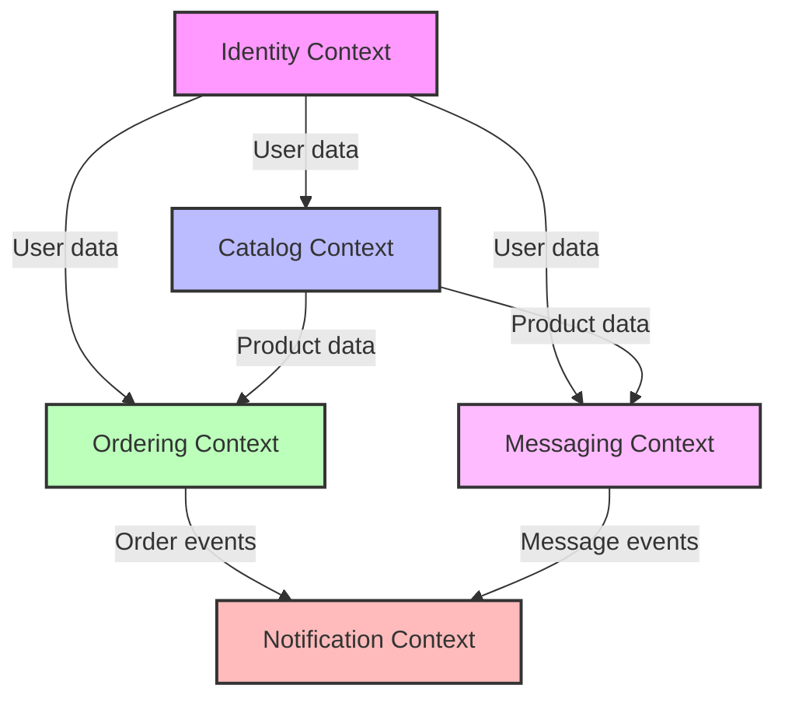
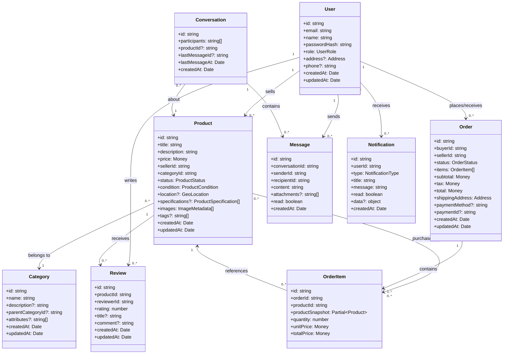

# Domain Model for Vecino Marketplace

This directory contains the core domain model for the Vecino Marketplace application, following Domain-Driven Design principles.

## Bounded Contexts

The application is divided into the following bounded contexts:

1. **Identity Context** - User management, authentication, and authorization
2. **Catalog Context** - Product listings, categories, and reviews
3. **Ordering Context** - Order processing, checkout, and payment
4. **Messaging Context** - Communication between buyers and sellers
5. **Notification Context** - User notifications and alerts

## Context Map

The following diagram shows how the bounded contexts interact with each other:

## Core Entities

### Identity Context

- `User` - Users of the system with roles (buyer, seller, admin)

### Catalog Context

- `Product` - Items for sale in the marketplace
- `Category` - Product categories for organization
- `Review` - User reviews for products

### Ordering Context

- `Order` - A purchase transaction
- `OrderItem` - Individual items within an order

### Messaging Context

- `Conversation` - Communication thread between users
- `Message` - Individual messages within a conversation

### Notification Context

- `Notification` - User alerts and notifications

## Aggregates

- `UserAggregate` - User and related information
- `ProductAggregate` - Product and related specifications/images
- `CategoryAggregate` - Category and related attributes
- `OrderAggregate` - Order and its line items
- `ConversationAggregate` - Conversation and its messages
- `NotificationAggregate` - Standalone notification

## Value Objects

- `Address` - Structure for storing location data
- `Money` - Represents monetary values with currency
- `GeoLocation` - Latitude and longitude for location-based services
- `ProductSpecification` - Key-value pairs for product attributes
- `ImageMetadata` - Information about product images

## Domain Model Diagram

## Repository Structure

The domain model is structured as follows:

- `domain-model.ts` - Core domain model interfaces and types
- `domain-contexts.ts` - Definition of bounded contexts and their relationships
- `repositories/` - Repository interfaces for persistence operations
